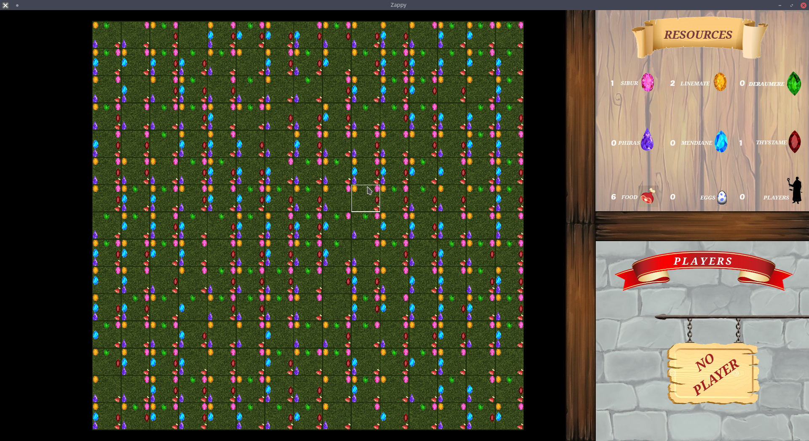
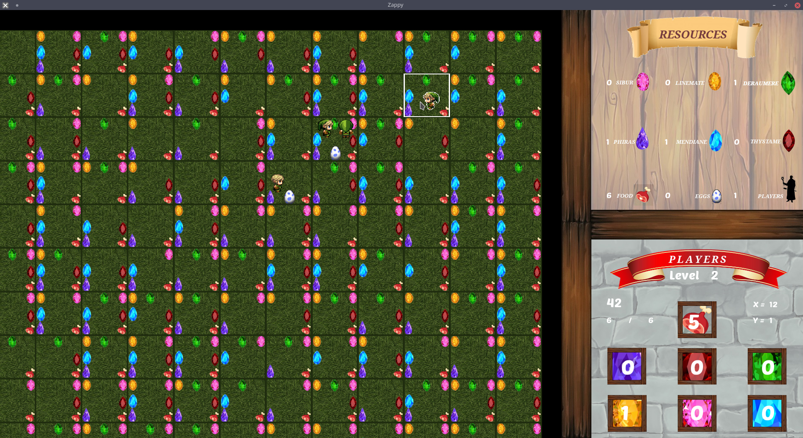
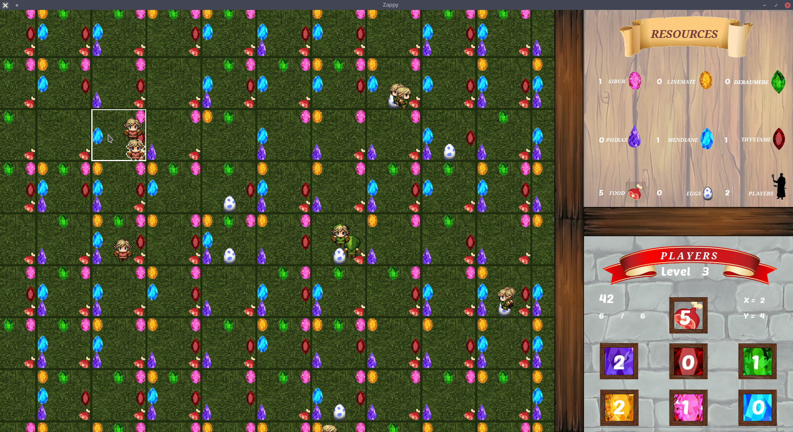

# Epitech - Zappy
<p align="center">
  
</p>

The goal of this project is to create a network game.
Several teams confront on a tiles map containing resources.
The winning team is the one with 6 players who reached maximum elevation.

## Usage:
```bash
make
./zappy_server -p port -x width -y height -n name1 name2 ... -c clientsNb -f freq
	port		 is the port number
	width		 is the width of the world
	height		 is the height of the world
	nameX		 is the name of the team X
	clientsNb	 is the number of authorized clients per team
	freq		 is the reciprocal of time unit forexecution of actions
  
./zappy_ai -p port -n name -h machine
	machine is the name of the machine; localhost by default
	name is the name of the team
	port is the port number
```
## Screenshots:

<p align="center">
   <br>
  
</p>

## Creators:

###### Rémi Gastaldi
```json
{
  "nom":"Gastaldi",
  "prenom":"Rémi",
  "email":"remi.gastaldi@epitech.eu",
  "linkedin": "https://www.linkedin.com/in/rémi-gastaldi/"
}
```

###### Léo Hubert
```json
{
  "nom":"Hubert",
  "prenom":"Léo",
  "email":"leo.hubert@epitech.eu",
  "linkedin": "https://www.linkedin.com/in/leohubert"
}
```

###### Flavien Sellet
```json
{
  "nom":"Sellet",
  "prenom":"Flavien",
  "email":"flavien.sellet@epitech.eu",
  "linkedin": "https://www.linkedin.com/in/flavien-sellet-32254b10a/"
}
```

###### Prost Matthias
```json
{
  "nom":"Prost",
  "prenom":"Matthias",
  "email":"matthias.prost@epitech.eu",
  "linkedin": "https://www.linkedin.com/in/matthias-prost/"
}
```

###### Cyril Puccio
```json
{
  "nom":"Puccio",
  "prenom":"Cyril",
  "email":"cyril.puccio@epitech.eu",
  "linkedin": "https://www.linkedin.com/in/cyrilpuccio/"
}
```

###### Thomas Augusto
```json
{
  "nom":"Augusto",
  "prenom":"Thomas",
  "email":"thomas.augusto@epitech.eu",
  "linkedin": "https://www.linkedin.com/in/thomas-augusto-8199b710a/"
}
